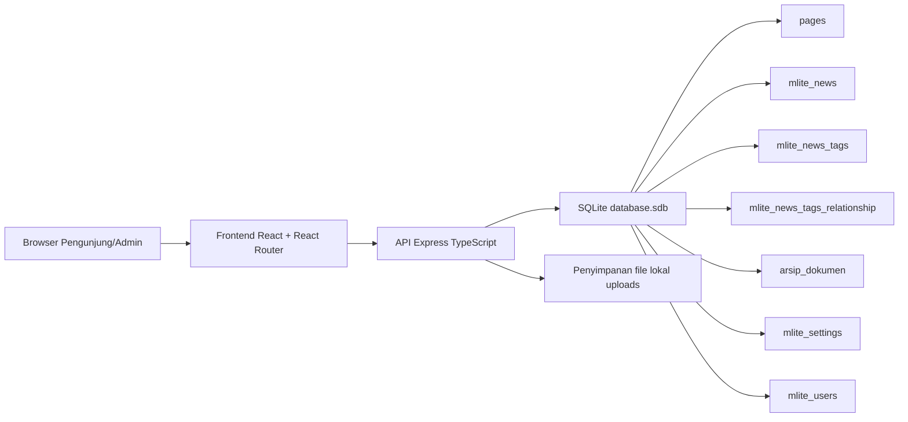
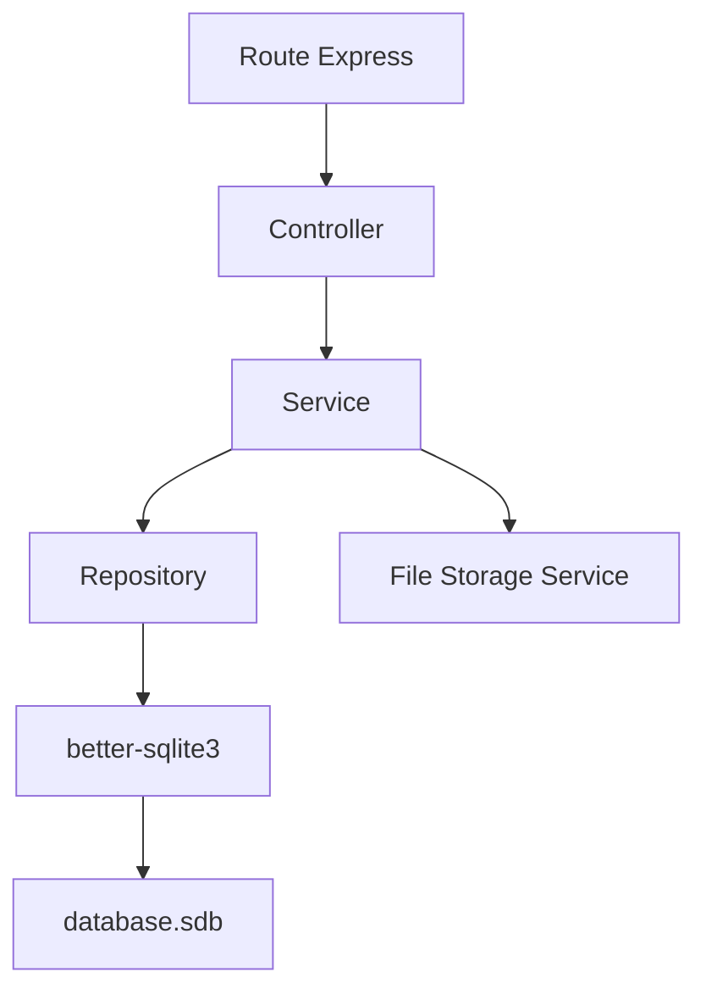
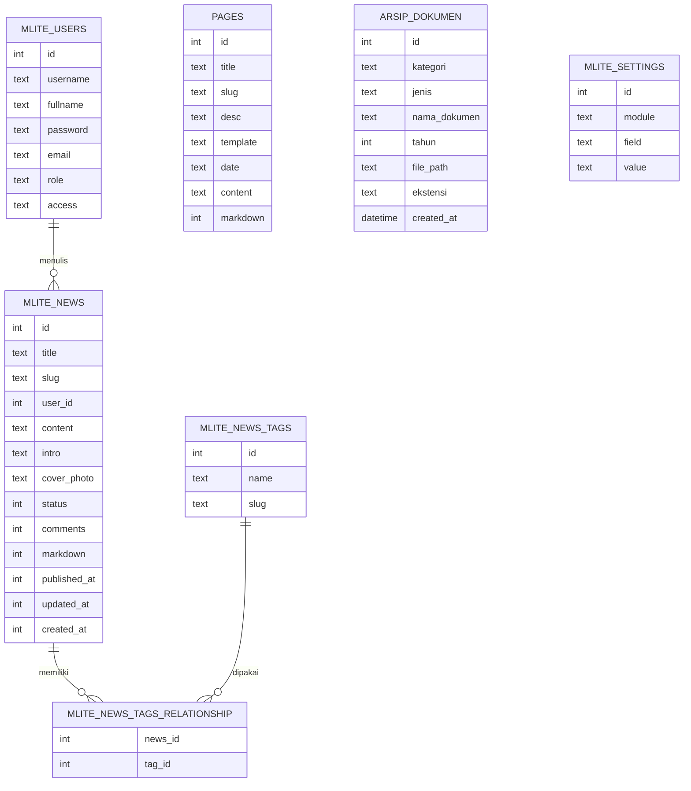

## 1. Desain Arsitektur


## 2. Deskripsi Teknologi
- Frontend: React 18 + TypeScript + React Router + Tailwind CSS + Zustand + `lucide-react`
- Backend: Express.js + TypeScript + better-sqlite3
- Inisialisasi: `vite-init` dengan template `react-express-ts`
- Database: SQLite menggunakan file eksisting `/Users/basoro/Server/data/www/rshdbarabaicom/database.sdb`
- Penyimpanan aset: direktori lokal aplikasi untuk cover berita dan dokumen arsip
- Validasi: Zod untuk validasi payload form dan API
- Testing: Vitest untuk utilitas/frontend dasar, dan verifikasi endpoint via `curl`

## 3. Definisi Rute
| Rute | Tujuan |
|-------|---------|
| `/` | Beranda publik yang mereplikasi struktur homepage lama |
| `/:slug` | Halaman konten generik dari tabel `pages` |
| `/news` | Daftar berita |
| `/news/:slug` | Detail berita |
| `/arsip-dokumen` | Daftar arsip dokumen publik |
| `/admin/login` | Login administrator |
| `/admin` | Dashboard CMS |
| `/admin/pages` | Manajemen halaman |
| `/admin/news` | Manajemen berita |
| `/admin/news/tags` | Manajemen tag berita |
| `/admin/arsip` | Manajemen arsip dokumen |
| `/admin/settings` | Manajemen pengaturan situs |

## 4. Definisi API
### 4.1 Tipe Data Utama
```ts
export type SiteSetting = {
  module: string;
  field: string;
  value: string | null;
};

export type PageItem = {
  id: number;
  title: string;
  slug: string;
  desc: string | null;
  template: string;
  date: string;
  content: string;
  markdown: number;
};

export type NewsItem = {
  id: number;
  title: string;
  slug: string;
  user_id: number;
  content: string;
  intro: string | null;
  cover_photo: string | null;
  status: number;
  comments: number;
  markdown: number;
  published_at: number;
  updated_at: number;
  created_at: number;
};

export type DocumentArchive = {
  id: number;
  kategori: string;
  jenis: string;
  nama_dokumen: string;
  tahun: number;
  file_path: string;
  ekstensi: string;
  created_at: string;
};
```

### 4.2 Endpoint Publik
| Method | Endpoint | Fungsi |
|-------|----------|--------|
| `GET` | `/api/public/bootstrap` | Mengambil pengaturan situs, menu, ringkasan homepage, dan footer |
| `GET` | `/api/public/pages/:slug` | Mengambil detail halaman berdasarkan slug |
| `GET` | `/api/public/news` | Mengambil daftar berita terbit dengan paginasi dan tag |
| `GET` | `/api/public/news/:slug` | Mengambil detail berita terbit |
| `GET` | `/api/public/arsip` | Mengambil daftar arsip dokumen dengan filter |

### 4.3 Endpoint Admin
| Method | Endpoint | Fungsi |
|-------|----------|--------|
| `POST` | `/api/admin/login` | Login admin dan membuat sesi |
| `POST` | `/api/admin/logout` | Logout admin |
| `GET` | `/api/admin/dashboard` | Ringkasan statistik CMS |
| `GET` | `/api/admin/pages` | Daftar halaman |
| `POST` | `/api/admin/pages` | Tambah halaman |
| `PUT` | `/api/admin/pages/:id` | Ubah halaman |
| `DELETE` | `/api/admin/pages/:id` | Hapus halaman |
| `GET` | `/api/admin/news` | Daftar berita |
| `POST` | `/api/admin/news` | Tambah berita |
| `PUT` | `/api/admin/news/:id` | Ubah berita |
| `DELETE` | `/api/admin/news/:id` | Hapus berita |
| `GET` | `/api/admin/news/tags` | Daftar tag berita |
| `POST` | `/api/admin/news/tags` | Tambah tag |
| `PUT` | `/api/admin/news/tags/:id` | Ubah tag |
| `DELETE` | `/api/admin/news/tags/:id` | Hapus tag |
| `GET` | `/api/admin/arsip` | Daftar arsip dokumen |
| `POST` | `/api/admin/arsip` | Tambah arsip dokumen |
| `PUT` | `/api/admin/arsip/:id` | Ubah arsip dokumen |
| `DELETE` | `/api/admin/arsip/:id` | Hapus arsip dokumen |
| `GET` | `/api/admin/settings` | Ambil pengaturan situs |
| `PUT` | `/api/admin/settings` | Simpan pengaturan situs |

## 5. Diagram Arsitektur Server


## 6. Model Data
### 6.1 Definisi Model Data


### 6.2 Definisi Data dan Strategi Migrasi
```sql
-- Database utama tetap memakai file eksisting.
-- Tidak perlu mengganti nama tabel inti agar migrasi tetap kompatibel.

-- Indeks yang direkomendasikan untuk performa baca frontend.
CREATE INDEX IF NOT EXISTS idx_pages_slug ON pages(slug);
CREATE INDEX IF NOT EXISTS idx_news_slug ON mlite_news(slug);
CREATE INDEX IF NOT EXISTS idx_news_status_published ON mlite_news(status, published_at);
CREATE INDEX IF NOT EXISTS idx_arsip_tahun_kategori ON arsip_dokumen(tahun, kategori);
CREATE INDEX IF NOT EXISTS idx_settings_module_field ON mlite_settings(module, field);

-- Tabel sesi admin baru untuk aplikasi React + Express.
CREATE TABLE IF NOT EXISTS admin_sessions (
  id INTEGER PRIMARY KEY AUTOINCREMENT,
  user_id INTEGER NOT NULL,
  token TEXT NOT NULL UNIQUE,
  expires_at INTEGER NOT NULL,
  created_at INTEGER NOT NULL
);
CREATE INDEX IF NOT EXISTS idx_admin_sessions_token ON admin_sessions(token);
CREATE INDEX IF NOT EXISTS idx_admin_sessions_user_id ON admin_sessions(user_id);
```

## 7. Keputusan Implementasi
- Frontend publik dan CMS berada dalam satu proyek agar deployment, desain sistem, dan akses data lebih sederhana.
- Struktur slug lama dipertahankan, termasuk halaman yang berasal dari `pages`, agar SEO dan tautan lama tetap aman.
- Rute publik dipisahkan dari `/admin` untuk memudahkan proteksi autentikasi dan layout terpisah.
- Data dari tabel lama dipakai langsung; penambahan hanya dilakukan untuk kebutuhan sesi admin dan optimasi indeks.
- Konten HTML dari database dirender dengan sanitasi aman sebelum ditampilkan di frontend publik.
- Fitur dokter di beranda dapat dibuat sebagai data statis awal atau sumber placeholder terkonfigurasi apabila tabel dokter tidak berada di `database.sdb`.

## 8. Struktur Proyek
- `src/components`: komponen UI publik dan admin yang dapat dipakai ulang
- `src/pages`: halaman publik dan halaman CMS
- `src/hooks`: hook React untuk autentikasi, pengambilan data, dan filter
- `src/utils`: formatter, helper slug, sanitizer HTML, dan utilitas navigasi
- `src/store`: state global Zustand untuk bootstrap situs dan sesi admin
- `api`: server Express, controller, service, repository, middleware, dan utilitas SQLite
- `shared`: tipe bersama frontend dan backend
- `migrations`: SQL migrasi tambahan seperti indeks dan tabel `admin_sessions`
