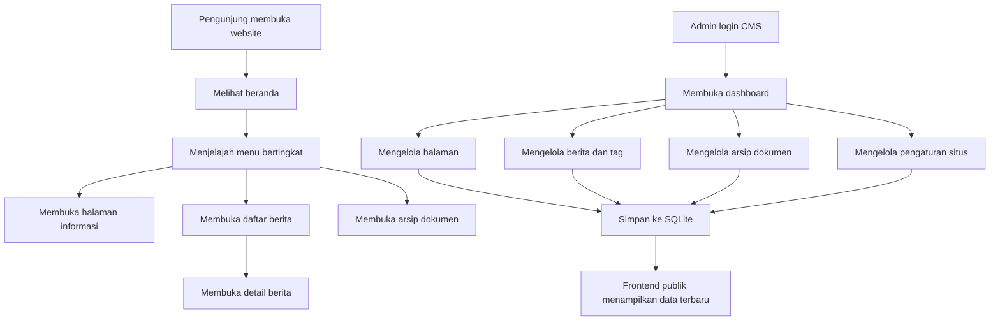

## 1. Gambaran Produk
Migrasi website RSUD H. Damanhuri Barabai dari template HTML lama ke aplikasi React berbasis SQLite tanpa mengubah struktur informasi, konten inti, dan pengalaman publik yang sudah dikenal pengguna.
- Produk baru harus mempertahankan tampilan, navigasi, halaman, berita, dan arsip dokumen yang ada, sekaligus menambahkan CMS admin agar pengelolaan konten tidak lagi bergantung pada file template lama.
- Nilai utama proyek adalah modernisasi teknis, kemudahan pemeliharaan, performa lebih baik, dan tersedianya panel administrasi terpadu untuk tim internal rumah sakit.

## 2. Fitur Inti

### 2.1 Peran Pengguna
| Peran | Metode Akses | Hak Akses Inti |
|------|----------------|----------------|
| Pengunjung Publik | Tanpa login | Melihat halaman publik, berita, detail berita, arsip dokumen, dan informasi rumah sakit |
| Admin | Login username dan password | Mengelola pengaturan situs, halaman, berita, tag berita, arsip dokumen, navigasi, dan aset konten |

### 2.2 Modul Fitur
1. **Beranda**: hero slider, statistik ringkas, profil singkat rumah sakit, layanan unggulan, tim dokter, berita terbaru, blok unduhan aplikasi/pengaduan.
2. **Halaman Konten**: halaman generik berbasis slug untuk profil, visi misi, fasilitas, kontak, layanan, FAQ, dan informasi lain.
3. **Daftar Berita**: listing berita dengan metadata penulis, tag, cover, tanggal, dan paginasi.
4. **Detail Berita**: detail artikel lengkap dengan cover, intro, isi, tag, penulis, dan area komentar/nonaktifkan placeholder komentar.
5. **Arsip Dokumen**: daftar arsip berdasarkan kategori, jenis, tahun, dan file dokumen.
6. **Pencarian & Navigasi**: header global, menu bertingkat, breadcrumb, footer, tautan cepat, dan panel info rumah sakit.
7. **CMS Dashboard**: ringkasan statistik konten, status data, dan akses cepat ke modul pengelolaan.
8. **CMS Halaman**: CRUD halaman statis berbasis tabel `pages`, termasuk judul, slug, deskripsi, template, dan konten HTML.
9. **CMS Berita**: CRUD berita berbasis `mlite_news`, pengelolaan status publikasi, cover, intro, isi, tag, dan penulis.
10. **CMS Arsip Dokumen**: CRUD arsip dokumen berbasis `arsip_dokumen`, termasuk unggah/tautan file, kategori, tahun, jenis, dan ekstensi.
11. **CMS Pengaturan Situs**: pengelolaan identitas situs dari `mlite_settings`, termasuk nama instansi, footer, email, dan data kontak tampilan.
12. **CMS Autentikasi**: login admin berbasis tabel `mlite_users` dengan sesi aman.

### 2.3 Rincian Halaman
| Nama Halaman | Nama Modul | Deskripsi Fitur |
|-----------|-------------|-----------------|
| Beranda | Hero slider | Menampilkan 3 slide utama yang meniru pesan dan nuansa situs lama, termasuk CTA video atau tautan penting |
| Beranda | Statistik layanan | Menampilkan ringkasan jumlah kamar, paramedis, dokter, dan kapasitas ICU |
| Beranda | Profil singkat | Menampilkan pengantar rumah sakit, direktur, dan tautan ke halaman profil/kontak |
| Beranda | Layanan unggulan | Carousel/grid layanan utama yang mengarah ke halaman layanan terkait |
| Beranda | Tim dokter | Menampilkan daftar dokter unggulan atau placeholder data jika sumber dokter eksternal belum tersedia |
| Beranda | Berita terbaru | Menampilkan artikel terkini dari `mlite_news` |
| Beranda | Aplikasi & kontak | Menampilkan kanal unduhan APAM, pengaduan, dan nomor penting |
| Halaman Konten | Hero judul | Menampilkan judul halaman dan breadcrumb |
| Halaman Konten | Konten utama | Merender konten HTML dari `pages.content` dengan gaya tipografi yang rapi |
| Daftar Berita | Grid artikel | Menampilkan berita dengan cover, tag, penulis, tanggal, dan tombol baca |
| Daftar Berita | Paginasi | Navigasi antar halaman daftar berita |
| Detail Berita | Header artikel | Menampilkan cover, judul, penulis, tanggal, dan tag |
| Detail Berita | Isi artikel | Menampilkan intro dan isi HTML artikel |
| Arsip Dokumen | Filter data | Filter berdasarkan tahun, kategori, jenis, dan kata kunci |
| Arsip Dokumen | Tabel/kartu arsip | Menampilkan nama dokumen, kategori, tahun, jenis, dan tautan unduh |
| Layout Global | Header | Menampilkan topbar, logo, jam layanan, tombol daftar, dan menu bertingkat |
| Layout Global | Extra info panel | Menampilkan profil singkat, alamat, telepon, email, dan media sosial |
| Layout Global | Footer | Menampilkan identitas rumah sakit, layanan utama, tautan penting, sosial media, dan copyright |
| CMS Login | Form login | Validasi kredensial admin dan pembuatan sesi |
| CMS Dashboard | Ringkasan sistem | Menampilkan jumlah halaman, berita, tag, arsip dokumen, dan status pengaturan |
| CMS Halaman | Editor konten | Form CRUD judul, slug, deskripsi, template, tanggal, dan isi |
| CMS Berita | Manajemen berita | Form CRUD artikel, cover, intro, isi, status, tanggal terbit, dan tag |
| CMS Tag Berita | Manajemen tag | CRUD tag dan relasinya ke berita |
| CMS Arsip | Manajemen dokumen | CRUD metadata dokumen dan file arsip |
| CMS Pengaturan | Pengaturan situs | Edit pasangan `module/field/value` yang dipakai frontend |

## 3. Proses Inti
Pengunjung membuka beranda, menjelajah menu bertingkat, lalu masuk ke halaman informasi, berita, atau arsip dokumen. Saat membuka berita, pengunjung dapat berpindah dari daftar berita ke detail artikel. Tim admin login ke CMS, memperbarui halaman, berita, arsip, dan pengaturan; setelah disimpan, data langsung muncul di frontend publik karena frontend membaca SQLite yang sama.

## 4. Desain Antarmuka
### 4.1 Gaya Desain
- Warna utama mengikuti identitas situs lama: hijau rumah sakit sebagai warna primer, putih sebagai dasar, dan aksen kuning/emas lembut untuk penekanan.
- Gaya tombol mempertahankan nuansa tema lama: rounded, kontras kuat, dan memiliki keadaan hover yang jelas.
- Tipografi mengutamakan kombinasi display serif modern untuk judul dan sans-serif humanis untuk isi agar terlihat formal namun tetap ramah.
- Tata letak desktop-first dengan header kaya informasi, hero penuh lebar, section modular, kartu layanan/berita, dan footer informatif.
- Ikon menggunakan `lucide-react` dengan gaya garis bersih agar modern namun tidak mengubah struktur visual terlalu jauh.

### 4.2 Ikhtisar Desain Halaman
| Nama Halaman | Nama Modul | Elemen UI |
|-----------|-------------|-------------|
| Beranda | Hero | Slider lebar penuh, overlay gelap, tipografi besar, CTA video, transisi halus |
| Beranda | Statistik | Kartu angka dengan ikon, warna selang-seling, animasi masuk ringan |
| Beranda | Layanan | Grid/carousel kartu dengan ikon, judul, ringkasan, dan tautan |
| Beranda | Dokter | Kartu profil dengan foto, spesialisasi, dan tombol aksi |
| Beranda | Berita | Kartu artikel dengan gambar, metadata, dan tipografi tegas |
| Halaman Konten | Konten | Hero judul, breadcrumb, area artikel lebar nyaman dibaca |
| Daftar Berita | Listing | Grid responsif, gambar cover konsisten, filter/paginasi sederhana |
| Detail Berita | Artikel | Hero kecil, informasi metadata, area isi HTML, gaya tipografi editorial |
| Arsip Dokumen | Arsip | Toolbar filter, tabel desktop dan kartu mobile, badge kategori/jenis |
| CMS | Dashboard | Sidebar gelap, topbar sederhana, kartu statistik, tabel aktivitas |
| CMS | Form editor | Input terstruktur, textarea/editor HTML, validasi jelas, aksi simpan/publikasi |

### 4.3 Responsivitas
Antarmuka dirancang desktop-first untuk menyesuaikan struktur menu lama yang kompleks, lalu diadaptasi untuk tablet dan mobile dengan drawer navigation, kartu bertumpuk, tabel responsif, dan area klik yang ramah sentuh.

### 4.4 Panduan Konsistensi Migrasi
- Struktur navigasi publik harus mengikuti menu lama beserta pengelompokan “Tentang Kami”, “Layanan”, dan “Informasi”.
- Slug halaman lama harus tetap dipertahankan agar tautan yang sudah ada tidak rusak.
- Konten dari `pages`, `mlite_news`, `mlite_news_tags`, `mlite_news_tags_relationship`, `arsip_dokumen`, dan `mlite_settings` menjadi sumber data utama.
- Fitur booking pada situs lama dapat ditampilkan ulang sebagai tombol/CTA dan formulir placeholder bila endpoint lama belum tersedia di database saat migrasi tahap pertama.
